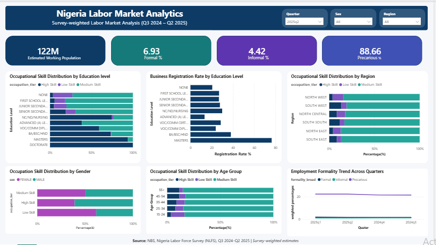
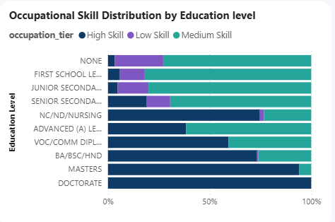
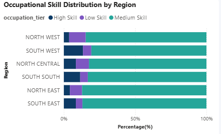
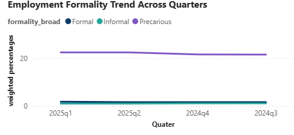
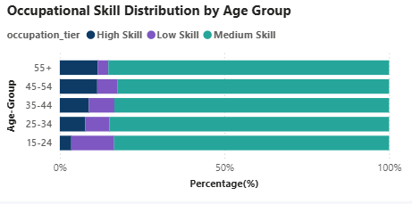

# nigeria-labour-market-analysis

Survey-weighted analysis of Nigeria's labour market using the Nigeria Labour Force Survey (NLFS) Dataset from NBS

## Background and Overview

The Nigeria Labour Force Survey (NLFS), published by the National Bureau of Statistics (NBS), is Nigeria's primary source of information on employment, education, occupations, business activities, and other labour market characteristics.

This project was undertaken to examine the structure of Nigeria's labour market and identify how demographic, educational, business, and regional characteristics are associated with labour market participation, occupational distribution, and business registration. The objective was to transform the NLFS microdata into meaningful labour market insights that can support evidence-based policymaking, workforce planning, and future labour market research.

To achieve this, the project analyzed four consecutive survey quarters (Q3 2024 to Q2 2025), developed survey-weighted labour market indicators, validated selected findings using appropriate statistical methods, and presented the results through an interactive Power BI dashboard.

## Data Structure Overview

The analysis was conducted using four consecutive quarters of the Nigeria Labour Force Survey (NLFS): Q3 2024, Q4 2024, Q1 2025, and Q2 2025.
Each quarterly dataset contains detailed information describing the socioeconomic and labour market characteristics of individuals across Nigeria. The variables cover multiple aspects of the labour market, including:

- Demographic characteristics (age, sex, state, geopolitical zone, and urban/rural residence)
- Educational attainment
- Employment status
- Occupation and industry
- Business ownership and registration
- Employment type
- Survey design variables, including survey weights, primary sampling units (PSUs), and strata

To create a unified analytical dataset, the four quarterly datasets were first consolidated in Python before being imported into PostgreSQL. PostgreSQL served as the central analytical database, where SQL queries were used to explore the data, perform data cleaning, validate data quality, and engineer new variables required for the analysis.

The final analytical dataset was then used for survey-weighted statistical analysis in R and interactive dashboard development in Power BI. Survey weights were applied throughout the analysis to ensure that all reported estimates remained nationally representative. Although the datasets were stored together, each survey quarter was analysed independently to preserve the integrity of the survey design and ensure direct comparability across quarters.

## Executive Summary

Analysis of the Nigeria Labour Force Survey reveals that Nigeria's labour market remained largely stable across the four survey quarters analysed. Most workers were employed in medium-skill occupations, including clerical, sales, agricultural, craft, and machine operation jobs, while low-skill occupations, largely elementary occupations, also accounted for a substantial share of employment. In contrast, high-skill occupations, comprising managers, professionals, and technicians, represented only a relatively small proportion of the workforce throughout the survey period.

Individuals with higher educational attainment were more likely to work in high-skill occupations and, among business owners, were also more likely to operate registered businesses. However, workers across all educational levels continued to be concentrated largely in medium- and low-skill occupations. This suggests that while education improves labour market prospects, expanding access to more high-skill employment opportunities is equally important if educational attainment is to translate into better employment outcomes.

Differences were also observed across age groups and geopolitical zones. Young people aged 15–24 recorded the lowest participation in high-skill occupations, while older age groups were more represented in these occupations. Although work experience may partly contribute to this pattern, expanding internships, graduate trainee programmes, apprenticeships, and other school-to-work transition opportunities may help young people gain the practical experience needed to improve access to skilled occupations. Across regions, some geopolitical zones recorded slightly higher proportions of high-skill occupations than others, but the overall occupational structure remained broadly similar, suggesting that improving access to skilled employment is a nationwide challenge rather than one limited to specific regions.

Among business owners, individuals with higher educational attainment were more likely to operate registered businesses. Nevertheless, a large proportion of businesses remained unregistered, highlighting the need to encourage business formalisation through greater awareness, simplified registration processes, and policies that make formal registration more attractive to small business owners.

Overall, the study suggests that improving labour market outcomes requires more than increasing educational attainment alone. Alongside investments in education, greater emphasis should be placed on expanding skilled employment opportunities, strengthening the transition from education to work, encouraging business registration, and creating an environment where workers at different educational levels can access productive and rewarding employment.

## Dashboard Highlights

The interactive dashboard provides an overview of Nigeria's labour market across the four survey quarters using survey-weighted estimates. It enables users to explore the size of the working-age population represented by the survey, examine employment patterns across demographic groups, and compare labour market outcomes between quarters using interactive filters.

The dashboard also summarises workers into three broad employment categories created for this analysis:

Formal – employees receiving wages and self-employed individuals operating registered businesses.
Informal – employees without wages, unregistered self-employed workers, and dependent workers such as apprentices and household helpers.
Precarious – a project-defined category representing workers in more vulnerable labour market situations, including casual workers, people temporarily absent from work during the survey reference week, and individuals without current employment.

These categories provide a simplified view of employment conditions and complement the occupation-tier analysis presented throughout the dashboard.

Download the Interactive Power BI dashboard:
[Nigeria_Labour_Market_Dashboard.pbix](Dashboard/Nigeria_Labor_Market_Analysis.pbix)

**Note:** Unless otherwise stated, all dashboard screenshots in this README are from **Q2 2025**, the most recent survey quarter included in this study. The interactive Power BI dashboard allows users to explore the same analyses across **Q3 2024, Q4 2024, Q1 2025, and Q2 2025**.

## Insights

### Education and Occupational Skill Distribution

Educational attainment was consistently associated with the type of occupations people held across all four survey quarters. Individuals with higher levels of education were more likely to be employed in high-skill occupations, such as managers, professionals, and technicians, while those with lower educational attainment were more concentrated in medium-skill occupations (including clerical, sales, agricultural, craft, and machine operation jobs) and low-skill occupations (elementary occupations).

Although the likelihood of working in high-skill occupations increased with educational attainment, high-skill jobs still accounted for only a relatively small proportion of total employment. Most workers, including many with higher levels of education, remained employed in medium- and low-skill occupations.

This pattern suggests that while education improves access to higher-skilled occupations, expanding the availability of skilled employment opportunities is equally important to ensure that educational attainment translates into better labour market outcomes.

The consistency of this pattern across all four survey quarters suggests that the relationship remained stable throughout the survey period rather than being driven by short-term changes in the labour market.

### Regional Differences in Occupational Skill Distribution

The distribution of occupational skill levels varied across Nigeria's geopolitical zones in every survey quarter. Some regions, particularly the South West and South South, recorded slightly higher proportions of workers in high-skill occupations, while other regions had relatively larger shares of workers in medium- and low-skill occupations.

Despite these differences, the overall occupational structure remained broadly similar across all regions. Medium-skill occupations, including clerical, sales, agricultural, craft, and machine operation jobs, consistently accounted for the largest share of employment, while high-skill occupations remained a relatively small proportion of the workforce nationwide.

Although regional differences were observed, they were modest compared with the overall similarity in occupational patterns across the country. This suggests that expanding access to high-skill employment is a national challenge rather than one confined to particular geopolitical zones.

## Education and Business Registration

Among self-employed individuals, business registration increased with educational attainment across all four survey quarters. Individuals with higher levels of education were consistently more likely to operate registered businesses than those with lower educational attainment.

Nevertheless, registered businesses represented only a small proportion of all businesses, indicating that a large share of business owners continue to operate outside the formal regulatory system. This suggests that educational attainment alone is insufficient to achieve widespread business formalization.

The consistency of this relationship across the survey quarters highlights the potential value of combining awareness campaigns, simplified registration procedures, and business support initiatives to improve formal business participation.

### Labour Market Trends Across Survey Quarters

While the earlier analyses focused on how education, age, and region relate to occupational outcomes, this analysis provides a broader view of how the labour market evolved over the four survey quarters.

The survey-weighted results show that the overall composition of employment remained largely unchanged throughout the study period. Across every quarter, the project's precarious employment category accounted for the largest share of the labour force, while formal and informal employment represented much smaller proportions and changed very little between survey quarters. Although minor fluctuations were observed over time, the overall pattern remained remarkably consistent throughout the period covered by the survey.

Although small fluctuations were observed between quarters, the overall pattern changed very little throughout the period covered by the survey. This consistency provides useful context for the occupation-tier analysis, suggesting that the relationships observed between education, occupation, age, and region were identified within a labour market whose overall structure remained relatively stable during the study period.

### Occupational Skill Distribution Acrosss Age Groups

Young Workers Face the Greatest Barriers to High Skill Occupation

The age distribution reveals clear differences in the types of occupations held across the labour force. Workers aged 15–24 recorded the lowest participation in high-skill occupations such as managers, professionals, and technicians. Instead, they were more concentrated in medium-skill occupations, including clerical, sales, agricultural, craft, and machine operation jobs, as well as low-skill occupations such as elementary occupations.

Participation in high-skill occupations generally increased among older age groups, suggesting that workers tend to move into more skilled occupations as they progress through their careers. However, high-skill occupations remained a minority across all age groups, with medium-skill occupations consistently accounting for the largest share of employment.

While work experience may partly contribute to these patterns, expanding internships, graduate trainee programmes, apprenticeships, and other school-to-work transition opportunities may help young people gain the practical experience needed to access high-skill occupations earlier in their careers. At the same time, the relatively small share of high-skill occupations across all age groups suggests that increasing the availability of skilled employment opportunities is equally important.

## Recommendations

**1. Expand access to high-skill employment opportunities**

The analysis shows that higher educational attainment is associated with greater participation in high-skill occupations. However, high-skill occupations remained a relatively small share of total employment across all educational levels. Creating more professional, technical, and managerial employment opportunities would help ensure that educational attainment translates into better occupational outcomes.

**2. Strengthen school-to-work transition programmes**

Young people aged 15–24 recorded the lowest participation in high-skill occupations. Expanding internships, graduate trainee programmes, apprenticeships, and stronger partnerships between educational institutions and employers could help young people acquire the practical experience required to transition into skilled occupations earlier in their careers.

**3. Promote business registration among small business owners**

Individuals with higher educational attainment were more likely to operate registered businesses. However, many businesses remained unregistered throughout the study period. Increasing awareness of the benefits of business registration, simplifying registration procedures, and improving access to government support for registered businesses may encourage greater participation in the formal business sector.

**4. Develop region-specific workforce development strategies**

Although differences in occupational patterns were observed across geopolitical zones, no region recorded a dominant share of high-skill occupations. Workforce development policies should therefore be tailored to the economic strengths and labour market needs of individual regions while also expanding access to skilled employment opportunities across the country.

## Tools Used

- **Python** – Data cleaning, data merging, feature engineering, and preprocessing.
- **PostgreSQL** – Data storage, querying, and transformation.
- **R** – Survey-weighted statistical analysis using Rao-Scott Chi-square tests.
- **Power BI** – Interactive dashboard development and data visualization.

## Author

**Favour Nwani**

Email: favournwani67@gmail.com

LinkedIn: www.linkedin.com/in/nwani-favour-chioma-ab2426320
