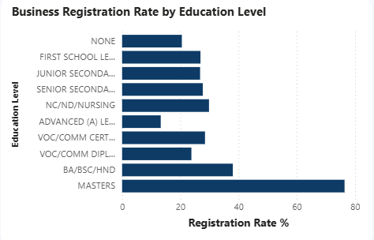

# nigeria-labour-market-analysis

Survey-weighted analysis of Nigeria's labour market using the Nigeria Labour Force Survey (NLFS) Dataset from NBS

## Background and Overview

The Nigeria Labour Force Survey (NLFS), published by the National Bureau of Statistics (NBS), is Nigeria's primary source of information on employment, education, occupations, business activities, and other labour market characteristics.

This project was undertaken to examine the structure of Nigeria's labour market and identify the demographic, educational, occupational, business, and regional factors associated with employment outcomes. The objective was to transform the NLFS microdata into meaningful labour market insights that can support evidence-based policymaking, workforce planning, and future labour market research.

To achieve this, the project analyzed four consecutive survey quarters (Q3 2024 to Q2 2025), developed survey-weighted labour market indicators, validated selected findings using appropriate statistical methods, and presented the results through an interactive Power BI dashboard.

## Data Structure Overview

The analysis was conducted using four consecutive quarters of the Nigeria Labour Force Survey (NLFS): Q3 2024, Q4 2024, Q1 2025, and Q2 2025.
Each quarterly dataset contains detailed information describing the socioeconomic and labour market characteristics of individuals across Nigeria. The variables cover multiple aspects of the labour market, including:

- Demographic characteristics (age, sex, state, geopolitical zone, and urban/rural residence)
- Educational attainment
- Employment status
- Occupation and industry
- Business ownership and registration
- Employment type
- Survey design variables, including survey weights, primary sampling units (PSUs), and strata

To create a unified analytical dataset, the four quarterly datasets were first consolidated in Python before being imported into PostgreSQL. PostgreSQL served as the central analytical database, where SQL queries were used to explore the data, perform data cleaning, validate data quality, and engineer new variables required for the analysis.

The final analytical dataset was then used for survey-weighted statistical analysis in R and interactive dashboard development in Power BI. Survey weights were applied throughout the analysis to ensure that all reported estimates remained nationally representative. Although the datasets were stored together, each survey quarter was analysed independently to preserve the integrity of the survey design and ensure direct comparability across quarters.

## Executive Summary

Analysis of the Nigeria Labour Force Survey reveals that Nigeria's labour market is characterized by persistently low levels of formal employment across demographic, educational, occupational, and regional groups. While higher educational attainment is associated with improved access to formal employment, formal employment remains low even among the most educated groups, with the majority of workers still engaged in informal, precarious (casual work, unemployment, and other forms of unstable labour market participation) forms of work.

The analysis also reveals clear differences in labour market outcomes across age groups, occupations, education levels, and geopolitical regions. Although some regions recorded slightly higher levels of formal employment than others, no region consistently achieved high levels of formal employment, indicating that labour market challenges are structural rather than location-specific.

Among business owners, individuals with higher levels of education were more likely to operate registered businesses. However, business registration remained relatively low overall, suggesting that many businesses continue to operate outside the formal regulatory system.

Overall, the findings indicate that Nigeria's labour market challenges cannot be explained by a single factor. While education, age, and geographical location all influence labour market outcomes, the persistently low levels of formal employment across the country point to a broader shortage of quality employment opportunities. The findings also highlight the need to encourage business registration through greater awareness and simpler registration processes, while expanding access to decent jobs capable of absorbing Nigeria's growing workforce.

## Dashboard Highlights

The interactive dashboard summarizes the key labour market indicators across the four survey quarters using survey-weighted estimates. At a glance, users can explore the size of the working-age population represented by the survey, together with the proportions of workers in formal, informal, and precarious employment. Interactive filters also allow comparisons across quarters and demographic groups.

## Insights

### Education and Employment Formality

Educational attainment was consistently associated with access to formal employment across all four survey quarters. Individuals with higher levels of education generally recorded higher proportions of formal employment than those with lower educational attainment.

However, the improvement was relatively small. Even among individuals with tertiary education, formal employment remained a minority outcome, while informal and insecure forms of employment continued to account for the majority of workers. This suggests that although education improves labour market prospects, it is not sufficient on its own to overcome the structural shortage of quality jobs.

The consistency of this pattern across all four quarters indicates that the relationship is persistent rather than a short-term labour market fluctuation.

### Regional Differences in Employment Formality

Formal employment varied across Nigeria's geopolitical zones in every survey quarter. The South West and South South consistently recorded the highest levels of formal employment, while other regions generally recorded lower proportions.

Despite these differences, the overall pattern remained largely unchanged across all four quarters. Even in the highest-performing regions, formal employment remained relatively low, while informal and insecure forms of employment continued to dominate the labour market. This indicates that the challenge is national rather than regional.

The findings suggest that regional differences exist, but they are relatively small when viewed against the broader structural shortage of formal employment across the country.

## Education and Business Registration

Among self-employed individuals, business registration increased with educational attainment across all four survey quarters. Individuals with higher levels of education were consistently more likely to operate registered businesses than those with lower educational attainment.

Nevertheless, registered businesses represented only a small proportion of all businesses, indicating that a large share of business owners continue to operate outside the formal regulatory system. This suggests that educational attainment alone is insufficient to achieve widespread business formalization.

The consistency of this relationship across the survey quarters highlights the potential value of combining awareness campaigns, simplified registration procedures, and business support initiatives to improve formal business participation.

### Labour Market Trends Across Survey Quarters

Labour Market Structure Remained Stable Across Survey Quarters
The survey-weighted analysis shows that the overall structure of Nigeria's labour market remained remarkably stable throughout the four survey quarters analysed. Across every quarter, formal employment consistently accounted for only a small proportion of total employment, while informal and precarious forms of work continued to dominate the labour market.

Although small fluctuations were observed between quarters, the overall pattern remained largely unchanged, suggesting that the labour market challenges identified in this study are structural rather than temporary. The persistence of these trends across consecutive quarters indicates that the observed employment patterns are not isolated events but reflect broader characteristics of Nigeria's labour market.

### Employment Outcomes Across Age Groups

Young Workers Face the Greatest Employment Challenges

The age distribution reveals clear differences in employment outcomes across the labour force. Younger workers aged 15–24 recorded the lowest levels of formal employment and were more likely to be engaged in informal, casual, or other forms of insecure work.

While access to formal employment improved slightly among older age groups, formal employment never became the dominant employment category, even during the peak working ages. Instead, informal and insecure employment continued to account for the majority of labour market participation across almost every age group.

These findings suggest that the labour market challenge extends beyond work experience alone. Although experience may improve employment prospects, the consistently low levels of formal employment across all age groups point to a broader shortage of quality employment opportunities capable of absorbing Nigeria's workforce.

## Recommendations

**Strengthen job creation for educated youths**

While higher educational attainment is associated with improved employment outcomes, many educated Nigerians remain outside formal employment. Expanding graduate employment programmes, internships, and private-sector partnerships could help bridge the transition from education to stable employment.

**Promote business registration among small business owners**

The analysis suggests that education is associated with a greater likelihood of operating a registered business. Increasing awareness of the benefits of business registration and simplifying the registration process may encourage more informal businesses to formalise.

**Target regional labour market interventions**

Although employment patterns differ across geopolitical zones, informal and precarious employment remain dominant nationwide. Policies should therefore be tailored to the specific labour market characteristics of each region rather than adopting a one-size-fits-all approach.
